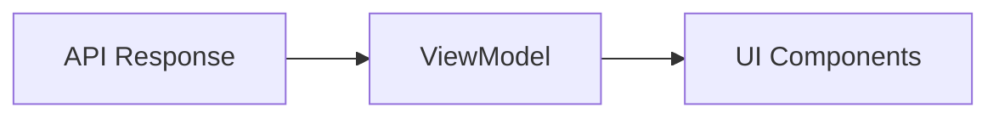

# ポートフォリオ A 方針ドキュメント

> **目的**
> ユーザーが `package-lock.json` / `package.json` をアップロードすると、依存パッケージを抽出し、
> 脆弱性レポートを表示するデモアプリケーション。

---

## 1. 💎 このポートフォリオで示す価値（React/FE 観点）

### "脆弱性一覧を受け取るだけ"ではなく、判断と行動につなげる UI

- **情報設計**: サマリーで全体像を把握 → フィルタで絞り込み → 詳細で意思決定。
- **アクションガイド**: 「何をすべきか」を示す推奨アクションを提示。

### 非同期フローと状態遷移

- **状態の可視化**: アップロード中・解析中・完了・エラーを明確に区別。
- **UI 設計**: エラー表示、空状態、進捗表示を意図的に作り込む。

### 複雑なデータの可視化と操作

- **サマリー**: 重要度別の件数可視化
- **フィルタリング**: Severity / 依存タイプ（prod/dev）での絞り込み
- **グルーピング**: Root Dependency 単位でグループ化
- **詳細ドロワー**: Dependency Path / 参照リンク / 推奨アクション

### 品質と保守性

- **型定義**: API レスポンスと UI 表示用 ViewModel を分離
- **テスト**: 解析・集計ロジックのユニットテスト + E2E テスト

---

## 2. 🎯 スコープ（やること）

| カテゴリ       | 内容                                                                 |
| :------------- | :------------------------------------------------------------------- |
| **対象**       | `npm` の `package-lock.json` (v2/v3) / `package.json`                |
| **API**        | Next.js Route Handler (`POST /api/scans`) で解析                     |
| **依存抽出**   | JSON から name/version を抽出、直依存/依存タイプを推定               |
| **脆弱性照合** | **モック/Fixture + 決定論的生成**                                    |
| **永続化**     | Prisma + SQLite にプロジェクト/パッケージ/脆弱性を保存               |
| **プロジェクト操作** | 名前変更/削除は DB に反映（永続化）                           |
| **画面**       | アップロード / 解析中 / 結果一覧 / エラー / 空状態 / 設定（モック） |

### 結果表示の必須要素

1. **Summary**: 重要度別の件数可視化
2. **フィルタ**: Severity / Dependency Type (prod/dev)
3. **グルーピング**: Root Dependency によるグループ化
4. **詳細ドロワー**:
   - Dependency Path
   - 参照リンク
   - 推奨アクション

---

## 3. 🚫 非スコープ（やらないこと）

完成度を高めるため、以下の項目は意図的にスコープ外とします。

| 項目                                   | 理由                                                 |
| :------------------------------------- | :--------------------------------------------------- |
| **npm 以外 (yarn/pnpm)**               | スコープを絞り UI 完成度を優先                      |
| **Lockfile v1 対応**                   | レガシー形式のため除外                              |
| **厳密な依存グラフ復元**               | 設計/実装コストが高いため MVP では簡易化             |
| **実脆弱性 DB 連携**                   | UI/UX に注力するため（将来拡張）                    |
| **認証・権限管理・メンバー招待**       | ポートフォリオの対象外                              |

---

## 4. 🏗 アーキテクチャ概要

### ディレクトリ構造 (App Router)

```text
app/
├── page.tsx                # アップロード画面
├── projects/
│   ├── page.tsx            # プロジェクト一覧
│   └── [id]/page.tsx       # 結果表示画面
├── settings/               # 設定（モック）
├── api/scans/route.ts      # POST /api/scans（解析実行）
├── lib/fixtures/           # モック脆弱性DB
└── types/                  # 型定義
```

### データフローと型設計

データ変換層を設け、API レスポンスを UI に適した形に整形します。



---

## 5. 🔒 データの扱い（プライバシー方針）

- **ファイル非保存**: アップロードされた JSON は解析後に破棄
- **保存するのは派生データのみ**: プロジェクト名、パッケージ、脆弱性など
- **モック前提**: 実際の脆弱性 DB には接続しない

---

## 6. 💻 開発フロー

### 主要コマンド

```bash
npm run dev
npm run build
npm run lint
npm test
npm run test:e2e
```

### モックデータの管理

- `app/lib/fixtures/`: テスト用の固定ルールと擬似ロジック

---

## 7. 🗣 面接での想定 QA

### Q: なぜ lockfile v2/v3 に絞ったのか？

> **A.** 完成度と精度のバランスです。モダンな標準である v2/v3 に絞ることで、
> 依存抽出の精度を高めつつ、UI/UX の完成度に時間を割くためです。

### Q: なぜ脆弱性データベースをモックにしたのか？

> **A.** フロントエンドのスキル評価に焦点を当てるためです。DB の精度やバックエンド構築よりも、
> **「データを受け取った後の UI/UX」** と **「データ変換ロジック」** を見てもらいたいと考えました。

---

## 8. 🚀 今後の拡張（Future Work）

1. **実データ連携**: OSV 等の脆弱性 DB に接続
2. **チーム状態の統一**: URL/Cookie で teamId を一貫管理
3. **依存グラフ拡張**: Dependency Path の精度向上
4. **CI/CD**: GitHub Actions で lint/test/build を自動化
