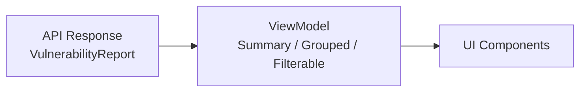

# ポートフォリオ A 方針ドキュメント

> **目的**
> ユーザーが `package-lock.json` をアップロードすると、依存パッケージ（name/version）を抽出し、脆弱性レポートを表示するデモアプリケーション。

---

## 1. 💎 このポートフォリオで示す価値（React/FE 観点）

### "脆弱性一覧を受け取るだけ"ではなく、判断と行動につなげる UI

- **情報設計**: サマリーで全体像を把握 → フィルタで絞り込み → 詳細で意思決定。
- **アクションガイド**: 「何をすべきか」を示す推奨アクションを提示。

### 非同期フローと高度な状態管理

- **状態の可視化**: アップロード進行中・解析中・完了・エラーを明確に区別。
- **技術選定**: TanStack Query（または useReducer）で複雑な非同期状態遷移を管理。

### 複雑なデータの可視化と操作

- **サマリー**: Critical/High/Medium/Low/Info の件数をバッジ等で可視化。
- **フィルタリング**: Severity や 依存タイプ（prod/dev）での絞り込み。
- **グルーピング**: 原因となる直依存（Root Dependency）単位でグループ化して表示。
- **詳細ドロワー**: 行クリックで依存パス (Dependency Path) や参照リンクを表示。

### 型安全と品質担保

- **型定義**: API レスポンス型と UI 表示用 ViewModel を明確に分離。
- **テスト**: 集計ロジックや ViewModel 変換のユニットテストを実装。

---

## 2. 🎯 スコープ（やること）

| カテゴリ       | 内容                                                                  |
| :------------- | :-------------------------------------------------------------------- |
| **対象**       | `npm` + `package-lock.json` (Lockfile Version 2/3) に限定             |
| **API**        | Next.js Route Handler (`POST /api/scans`) でアップロード処理          |
| **依存抽出**   | `package-lock.json` から解決済み依存 (name/version) を抽出            |
| **脆弱性照合** | **モック/Fixture** を使用（入力内容に応じて結果が変わる擬似ロジック） |
| **画面**       | アップロード / スキャン中 / 結果一覧 / エラー / 0 件（空状態）        |

### 結果表示の必須要素

1.  **Summary**: 重要度別の件数可視化
2.  **フィルタ**: Severity, Dependency Type (prod/dev)
3.  **グルーピング**: Root Dependency によるグループ化
4.  **詳細ドロワー**:
    - Dependency Path（脆弱性への経路）
    - 参照リンク（CVE, NPM Advisory）
    - 推奨アクション（更新 / overrides / リスク受容）

---

## 3. 🚫 非スコープ（やらないこと）

完成度を高めるため、以下の項目は意図的にスコープ外とします。

| 項目                     | 理由                                                             |
| :----------------------- | :--------------------------------------------------------------- |
| **npm 以外 (yarn/pnpm)** | 実装工数を抑え、UI の完成度を優先するため                        |
| **Lockfile v1 対応**     | レガシー形式のため除外                                           |
| **厳密な依存グラフ復元** | 完全な経路解析は複雑なため、MVP では簡易解析で対応               |
| **自動修正機能**         | `npm audit fix` 相当の機能は実装せず、判断支援に注力             |
| **認証・DB 保存**        | ユーザー機能や履歴保存は実装しない（「結果のみ保存」は拡張検討） |

---

## 4. 🏗 アーキテクチャ概要

### ディレクトリ構造 (App Router)

```text
app/
├── page.tsx              # アップロード画面
├── scans/
│   └── [id]/
│       └── page.tsx      # 結果表示画面
├── api/
│   └── scans/
│       └── route.ts      # POST /api/scans（解析実行）
├── components/           # 共通コンポーネント (UIパーツ)
├── lib/                  # ユーティリティ・ロジック
└── types/                # 型定義
```

### データフローと型設計

データ変換層を設け、API レスポンスを UI に適した形に整形します。



- **TanStack Query**: `useMutation` (アップロード), `useQuery` (結果取得)
- **ViewModel**: 生データを「集計済み」「グループ化済み」の状態で UI に提供

---

## 5. 🔒 データの扱い（プライバシー方針）

セキュリティとプライバシーを考慮した設計とします。

- **ファイル非保存**: アップロードされた `package-lock.json` は解析後に即破棄し、サーバーに保存しません。
- **結果非保存**: スキャン結果も永続化せず、リロードでクリアされます。
  - _拡張案_: ユーザー体験向上のため、ブラウザの `localStorage` への一時保存は検討。

---

## 6. 💻 開発フロー

### 主要コマンド

```bash
npm run dev      # 開発サーバー
npm run build    # 本番ビルド
npm run lint     # Lintチェック
npm test         # ユニットテスト (Jest/Vitest)
```

### モックデータの管理

- `app/lib/fixtures/`: テスト用の固定モックデータ
- `app/lib/mockVulnDb.ts`: 入力パッケージ名に応じて結果を返す擬似 DB ロジック

---

## 7. 🗣 面接での想定 QA

このポートフォリオを通じて伝えたい意図の整理。

### Q: なぜ npm/lockfile v2/3 に絞ったのか？

> **A.** 完成度と精度のバランスです。モダンな標準である v2/3 に絞ることで、依存抽出の精度を高めつつ、フロントエンド（UI/UX）の実装に時間を割くためです。

### Q: なぜ脆弱性データベースをモックにしたのか？

> **A.** フロントエンドのスキル評価に焦点を当てるためです。DB の精度やバックエンド構築よりも、**「データを受け取った後の UI/UX」** や **「複雑なデータの変換ロジック」** を見てもらいたいと考えました。

### Q: `npm audit` との違いは？

> **A.** `npm audit` は「出力して終わり」ですが、本アプリは **「判断と対応」** に重点を置いています。
> チームで画面を見ながら議論できる UI、優先度付けのためのフィルタ、具体的なアクションガイドを提供することで、脆弱性対応の業務フローを改善します。

---

## 8. 🚀 今後の拡張（Future Work）

時間があれば以下の機能追加を検討します。

1.  **実データ連携**: モック部分を OSV (Open Source Vulnerabilities) API 等に接続。
2.  **結果共有機能**: 結果を一時的に保存し、URL でチームメンバーに共有可能にする。
3.  **大量データの仮想化**: `react-window` 等を用いて、数千件の依存関係もスムーズに表示。
4.  **E2E テスト**: Playwright を導入し、アップロードから表示までの一連のフローを自動テスト。
