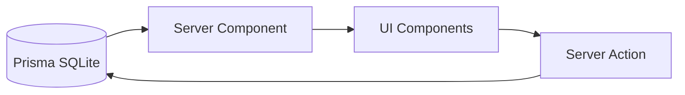

# ポートフォリオ A 方針ドキュメント

> **目的**
> ユーザーが `package-lock.json` をアップロードすると、依存パッケージ（name/version）を抽出し、脆弱性レポートを表示するデモアプリケーション。

---

## 1. 💎 このポートフォリオで示す価値（React/FE 観点）

### "脆弱性一覧を受け取るだけ"ではなく、判断と行動につなげる UI

- **情報設計**: サマリーで全体像を把握 → フィルタで絞り込み → 詳細で意思決定。
- **アクションガイド**: 「何をすべきか」を示す推奨アクションを提示。

### SSR オンリーのデータフェッチ戦略

- **状態の可視化**: アップロード進行中・解析中・完了・エラーを明確に区別。
- **技術選定**: Next.js App Router の Server Components + Server Actions で完結。
- **CSR ライブラリ不使用**: TanStack Query 等は別ポートフォリオ（Vite + FastAPI）で使用し、差別化を図る。

### 複雑なデータの可視化と操作

- **サマリー**: Critical/High/Medium/Low/Info の件数をバッジ等で可視化。
- **フィルタリング**: Severity や 依存タイプ（prod/dev）での絞り込み。
- **グルーピング**: 原因となる直依存（Root Dependency）単位でグループ化して表示。
- **詳細ドロワー**: 行クリックで依存パス (Dependency Path) や参照リンクを表示。

### 型安全と品質担保

- **型定義**: Prisma が自動生成。手動の型注釈を最小限に。
- **テスト**: Jest + RTL でコンポーネントテスト、Playwright で E2E テスト。

### 別ポートフォリオとの役割分担

| 見せたい要素            | 本アプリ（A） | 別ポートフォリオ（B） |
| :---------------------- | :------------ | :-------------------- |
| SSR / Server Components | ✅            | -                     |
| Server Actions          | ✅            | -                     |
| Prisma + 型安全         | ✅            | -                     |
| TanStack Query          | -             | ✅                    |
| OpenAPI codegen         | -             | ✅                    |
| react-hook-form + zod   | -             | ✅                    |

これにより **「両方のパターンを理解して使い分けている」** ことを示せる。

---

## 2. 🎯 スコープ（やること）

| カテゴリ       | 内容                                                                  |
| :------------- | :-------------------------------------------------------------------- |
| **対象**       | `npm` + `package-lock.json` (Lockfile Version 2/3) に限定             |
| **API**        | Next.js Route Handler (`POST /api/scans`) でアップロード処理          |
| **依存抽出**   | `package-lock.json` から解決済み依存 (name/version) を抽出            |
| **脆弱性照合** | **モック/Fixture** を使用（入力内容に応じて結果が変わる擬似ロジック） |
| **画面**       | アップロード / スキャン中 / 結果一覧 / エラー / 0 件（空状態）        |

### 結果表示の画面構成

| 画面             | URL                       | 目的                                        |
| :--------------- | :------------------------ | :------------------------------------------ |
| プロジェクト一覧 | `/projects`               | アップロード済みプロジェクトの一覧          |
| パッケージ一覧   | `/projects/[id]/packages` | 全パッケージをフラット表示、フィルタ/ソート |
| 依存ツリー       | `/projects/[id]/tree`     | 依存関係をツリー表示                        |
| パッケージ詳細   | `/packages/[packageId]`   | 単体パッケージの詳細、依存関係              |

### パッケージ一覧の機能

1.  **Summary**: 重要度別の件数可視化
2.  **フィルタ**: Severity, 依存タイプ（直接/間接）
3.  **ソート**: 名前、深刻度

### パッケージ詳細の機能

- このパッケージが依存するパッケージ一覧
- このパッケージに依存するパッケージ一覧
- 脆弱性情報（あれば）
- 対処法の案内（npm audit fix 等）

---

## 3. 🚫 非スコープ（やらないこと）

完成度を高めるため、以下の項目は意図的にスコープ外とします。

| 項目                     | 理由                                                 |
| :----------------------- | :--------------------------------------------------- |
| **npm 以外 (yarn/pnpm)** | 実装工数を抑え、UI の完成度を優先するため            |
| **Lockfile v1 対応**     | レガシー形式のため除外                               |
| **自動修正機能**         | `npm audit fix` 相当の機能は実装せず、判断支援に注力 |
| **認証**                 | ユーザー認証機能は実装しない                         |

---

## 4. 🏗 アーキテクチャ概要

### ディレクトリ構造 (App Router)

```text
app/
├── page.tsx              # アップロード画面
├── scans/
│   └── [id]/
│       └── page.tsx      # 結果表示画面
├── api/
│   └── scans/
│       └── route.ts      # POST /api/scans（解析実行）
├── components/           # 共通コンポーネント (UIパーツ)
├── lib/                  # ユーティリティ・ロジック
└── types/                # 型定義
```

### データフローと型設計

データ変換層を設け、API レスポンスを UI に適した形に整形します。



- **Server Components**: ページレンダリング時に Prisma 経由でデータ取得
- **Server Actions**: mutation（作成/更新/削除）後に `revalidatePath()` でキャッシュ無効化
- **クライアント状態**: ローディング UI 用の `useTransition` のみ、グローバル状態管理は不使用

### DB スキーマ設計（中間テーブル方式）

```prisma
model Project {
  id         String    @id @default(cuid())
  name       String
  fileName   String
  uploadDate DateTime  @default(now())
  status     String    @default("analyzing")
  packages   Package[]
}

model Package {
  id          String   @id @default(cuid())
  name        String
  version     String
  isDirect    Boolean  // package.json に直接書かれているか
  projectId   String
  project     Project  @relation(fields: [projectId], references: [id])

  // 依存関係（多対多）
  dependencies   PackageDependency[] @relation("DependsOn")
  dependedBy     PackageDependency[] @relation("DependedBy")

  // 脆弱性（あれば）
  vulnerability  Vulnerability?
}

model PackageDependency {
  id           String  @id @default(cuid())
  dependerId   String
  dependeeId   String
  depender     Package @relation("DependsOn", fields: [dependerId], references: [id])
  dependee     Package @relation("DependedBy", fields: [dependeeId], references: [id])

  @@unique([dependerId, dependeeId])
}

model Vulnerability {
  id          String  @id @default(cuid())
  severity    String
  cve         String
  description String
  packageId   String  @unique
  package     Package @relation(fields: [packageId], references: [id])
}
```

### データ取得パターン

| 画面           | 取得方法                                                       |
| :------------- | :------------------------------------------------------------- |
| パッケージ一覧 | `findMany()` フラット取得                                      |
| 依存ツリー     | `findMany({ include: dependencies })` + JS でツリー変換        |
| パッケージ詳細 | `findUnique({ include: dependencies, dependedBy })` 双方向取得 |

---

## 5. 🎛 SSR オンリー戦略と永続化

### なぜ SSR オンリーか？

このポートフォリオでは意図的に **CSR データフェッチライブラリを使用しない** 方針を取ります。

| ポートフォリオ            | データ取得戦略                           | 状態管理                    |
| :------------------------ | :--------------------------------------- | :-------------------------- |
| **本アプリ（A）**         | SSR (Server Components + Server Actions) | なし（`useTransition`のみ） |
| **別ポートフォリオ（B）** | CSR (TanStack Query + FastAPI)           | TanStack Query              |

これにより、面接時に **「両方の戦略を理解した上で使い分けている」** ことを示せます。

### データ永続化: Prisma + SQLite

- **Prisma**: TypeScript で型安全にデータ操作。SQL を書かずに済む。
- **SQLite**: ファイル 1 つで完結するローカル DB。開発時は `prisma/dev.db`。
- **Prisma Studio**: ブラウザで DB の中身をエクセル風に確認・編集可能。

```bash
# 開発フロー
npx prisma db push       # スキーマをDBに反映
npx prisma generate      # TypeScript 型を生成
npx prisma studio        # GUI でデータ確認
```

### デプロイ時の考慮

SQLite はサーバーレス環境（Vercel 等）では永続化されないため、本番デプロイ時は以下への移行を検討:

- **Turso**: SQLite 互換のエッジ DB（無料枠あり）
- **Vercel Postgres**: Vercel 公式の PostgreSQL

Prisma のコードはほぼ変更不要で移行可能。

---

## 6. 🔒 データの扱い（プライバシー方針）

セキュリティとプライバシーを考慮した設計とします。

- **ファイル非保存**: アップロードされた `package-lock.json` は解析後に即破棄し、保存しません。
- **スキャン結果**: Prisma SQLite に永続化。プロジェクト単位で削除可能。
- **デモ用途**: ポートフォリオとしての公開時は、定期的に DB をリセットする運用を想定。

---

## 7. 💻 開発フロー

### 主要コマンド

```bash
npm run dev      # 開発サーバー
npm run build    # 本番ビルド
npm run lint     # Lintチェック
npm test         # ユニットテスト (Jest/Vitest)
```

### モックデータの管理

- `app/lib/fixtures/`: テスト用の固定モックデータ
- `app/lib/mockVulnDb.ts`: 入力パッケージ名に応じて結果を返す擬似 DB ロジック

### 実装順序

```
1. Prisma セットアップ + スキーマ定義
   ↓
2. サンプル lock ファイルで解析 & DB 保存の動作確認
   ↓
3. 既存の Context を削除し、Server Components へ移行
   ↓
4. パッケージ一覧画面（フラット取得）
   ↓
5. パッケージ詳細画面
   ↓
6. 依存ツリー画面（余裕があれば）
   ↓
7. テスト（Jest/RTL + Playwright）
   ↓
8. アクセシビリティ対応
```

### テスト戦略

| 種別           | ツール     | 範囲                               |
| :------------- | :--------- | :--------------------------------- |
| ユニットテスト | Jest + RTL | コンポーネント、ロジック           |
| E2E テスト     | Playwright | アップロード → 結果表示の 1 フロー |

### 後回しにする項目

| 項目                   | タイミング | 理由                           |
| :--------------------- | :--------- | :----------------------------- |
| アクセシビリティ       | 機能完成後 | 一貫性を保つため後から一括対応 |
| MUI テーマカスタマイズ | 機能完成後 | 機能優先、見た目は後から調整   |
| パフォーマンス最適化   | 問題発生時 | SSR 構成で重くなりにくい       |

---

## 8. 🗣 面接での想定 QA

このポートフォリオを通じて伝えたい意図の整理。

### Q: なぜ npm/lockfile v2/3 に絞ったのか？

> **A.** 完成度と精度のバランスです。モダンな標準である v2/3 に絞ることで、依存抽出の精度を高めつつ、フロントエンド（UI/UX）の実装に時間を割くためです。

### Q: なぜ TanStack Query を使わず SSR オンリーにしたのか？

> **A.** 意図的な技術選定の差別化です。別ポートフォリオ（Vite + FastAPI）で TanStack Query を使用し、**両方のパターンを理解していること** を示すためです。Next.js の App Router を使うなら、Server Components + Server Actions で完結できる設計を選びました。

### Q: なぜ脆弱性データベースをモックにしたのか?

> **A.** UI/UX の評価に焦点を当てるためです。外部 API との連携よりも、**「取得したデータをどう見せるか」**、つまり情報設計・フィルタリング・判断支援 UI を見てもらいたいと考えました。

### Q: `npm audit` との違いは？

> **A.** `npm audit` は「出力して終わり」ですが、本アプリは **「判断と対応」** に重点を置いています。
> チームで画面を見ながら議論できる UI、優先度付けのためのフィルタ、具体的なアクションガイドを提供することで、脆弱性対応の業務フローを改善します。

### Q: ポートフォリオとして「難しいこと」をやっている？

> **A.** 正直に言うと、技術的に難しいことはしていません。フロントエンドの仕事の大部分は「当たり前のことをちゃんとやる」ことです。このポートフォリオでは、**Next.js App Router の正しい使い方**、**技術選定の意図を説明できること**、**完成させられること** を示したいと考えています。

---

## 10. 🚀 今後の拡張（Future Work）

時間があれば以下の機能追加を検討します。

1.  **実データ連携**: モック部分を OSV (Open Source Vulnerabilities) API 等に接続。
2.  **結果共有機能**: 結果を一時的に保存し、URL でチームメンバーに共有可能にする。
3.  **大量データの仮想化**: `react-window` 等を用いて、数千件の依存関係もスムーズに表示。
